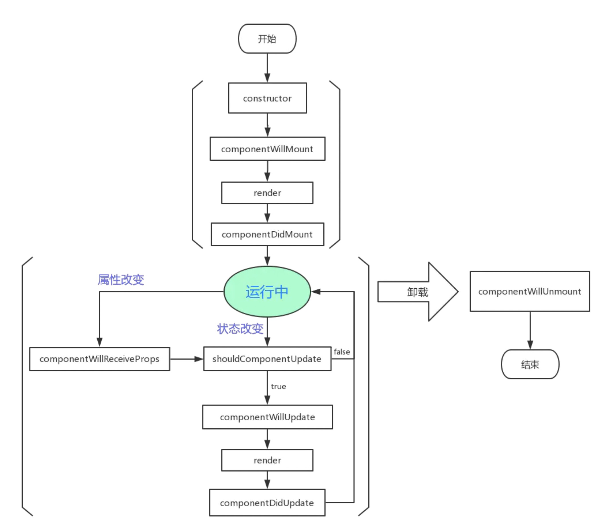
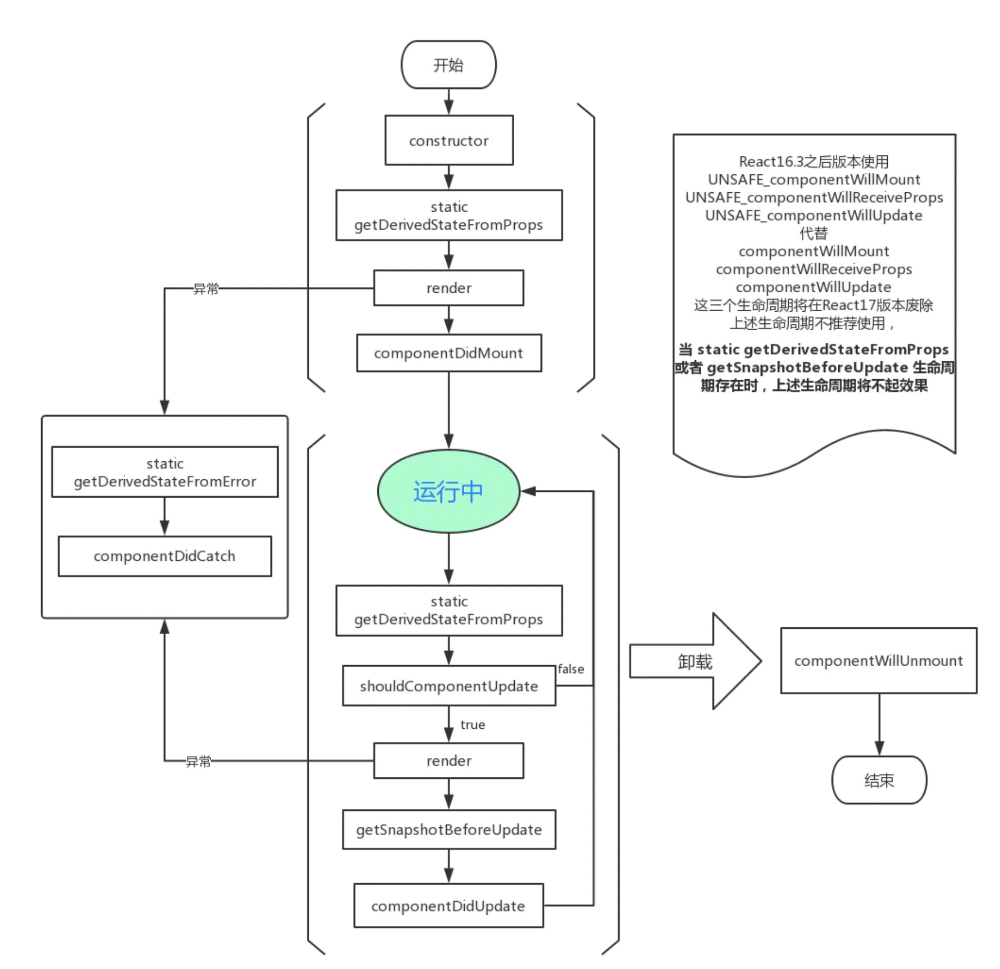

## React

### 1. 什么是react

- React 是 Facebook 在 2011 年开发的前端 JavaScript 库。
- 它遵循基于组件的方法，有助于构建可重用的UI组件。
- 它用于开发复杂和交互式的 Web 和移动 UI。
- 尽管它仅在 2015 年开源，但有一个很大的支持社区。

### 2. 什么是虚拟DOM

​		虚拟 DOM (VDOM)\**是真实 DOM 在内存中的表示。UI 的表示形式保存在内存中，并与实际的 DOM 同步。这是一个发生在渲染函数被调用和元素在屏幕上显示之间的步骤，整个过程被称为调和。

​		Virtual DOM 是一个轻量级的 JavaScript 对象，它最初只是 real DOM 的副本。它是一个节点树，它将元素、它们的属性和内容作为对象及其属性。 React 的渲染函数从 React 组件中创建一个节点树。然后它响应数据模型中的变化来更新该树，该变化是由用户或系统完成的各种动作引起的。

| **Real DOM**                   | **Virtual  DOM**               |
| ------------------------------ | ------------------------------ |
| 1. 更新缓慢。                  | 1. 更新更快。                  |
| 2. 可以直接更新 HTML。         | 2. 无法直接更新 HTML。         |
| 3. 如果元素更新，则创建新DOM。 | 3. 如果元素更新，则更新 JSX 。 |
| 4. DOM操作代价很高。           | 4. DOM 操作非常简单。          |
| 5. 消耗的内存较多。            | 5. 很少的内存消耗。            |

### 3. react有哪些优缺点

#### 3.1 优点

1. 它提高了应用的性能
2. 可以方便地在客户端和服务器端使用
3. 由于 JSX，代码的可读性很好
4. React 很容易与 Meteor，Angular 等其他框架集成
5. 使用React，编写UI测试用例变得非常容易

#### 3.2 缺点

1. React 只是一个库，而不是一个完整的框架
2. 它的库非常庞大，需要时间来理解
3. 新手程序员可能很难理解
4. 编码变得复杂，因为它使用内联模板和 JSX

#### 3.3 特点

1. 它使用**虚拟DOM **而不是真正的DOM。
2. 它可以用**服务器端渲染**。
3. 它遵循**单向数据流**或数据绑定。

### 4. 什么是JSX

​		JSX 是JavaScript XML 的简写。是 React 使用的一种文件，它利用 JavaScript 的表现力和类似 HTML 的模板语法。这使得 HTML 文件非常容易理解。此文件能使应用非常可靠，并能够提高其性能。

### 5. react与angular有何不同

| **主题**      | **React**          | **Angular**   |
| ------------- | ------------------ | ------------- |
| *1. 体系结构* | 只有 MVC 中的 View | 完整的 MVC    |
| *2. 渲染*     | 可以在服务器端渲染 | 客户端渲染    |
| *3. DOM*      | 使用 virtual DOM   | 使用 real DOM |
| *4. 数据绑定* | 单向数据绑定       | 双向数据绑定  |
| *5. 调试*     | 编译时调试         | 运行时调试    |
| *6. 作者*     | Facebook           | Google        |

### 6. 解释react中render()的作用

​		每个React组件强制要求必须有一个 **render()**。它返回一个 React 元素，是原生 DOM 组件的表示。如果需要渲染多个 HTML 元素，则必须将它们组合在一个封闭标记内，例如 `<form>`、`<group>`、`
` 等。此函数必须保持纯净，即必须每次调用时都返回相同的结果。

### 7. 什么是props

​		Props 是 React 中属性的简写。它们是只读组件，必须保持纯，即不可变。它们总是在整个应用中从父组件传递到子组件。子组件永远不能将 prop 送回父组件。这有助于维护单向数据流，通常用于呈现动态生成的数据。

### 8. React中的状态是什么

​		状态是 React 组件的核心，是数据的来源，必须尽可能简单。基本上状态是确定组件呈现和行为的对象。与props 不同，它们是可变的，并创建动态和交互式组件。可以通过 `this.state()` 访问它们。

### 9. 区分有状态和无状态组件

| **有状态组件**                                               | **无状态组件**                                  |
| ------------------------------------------------------------ | ----------------------------------------------- |
| 1. 在内存中存储有关组件状态变化的信息                        | 1. 计算组件的内部的状态                         |
| 2. 有权改变状态                                              | 2. 无权改变状态                                 |
| 3. 包含过去、现在和未来可能的状态变化情况                    | 3. 不包含过去，现在和未来可能发生的状态变化情况 |
| 4. 接受无状态组件状态变化要求的通知，然后将 props 发送给他们。 | 4.从有状态组件接收 props 并将其视为回调函数。   |

### 10. react生命周期

[生命周期图谱](https://projects.wojtekmaj.pl/react-lifecycle-methods-diagram/)

16.3之前生命周期：

16.3之后生命周期：

### 11. react中的refs

​		Refs 是 React 中引用的简写。它是一个有助于存储对特定的 React 元素或组件的引用的属性，它将由组件渲染配置函数返回。用于对 render() 返回的特定元素或组件的引用。当需要进行 DOM 测量或向组件添加方法时，它们会派上用场。

​		以下是应该使用 refs 的情况：

- 需要管理焦点、选择文本或媒体播放时
- 触发式动画
- 与第三方 DOM 库集成

### 12. react中的key的作用

​		key 用于识别唯一的 Virtual DOM 元素及其驱动 UI 的相应数据。它们通过回收 DOM 中当前所有的元素来帮助 React 优化渲染。这些 key 必须是唯一的数字或字符串，React 只是重新排序元素而不是重新渲染它们。这可以提高应用程序的性能。

### 13. redux遵循的三个原则

1. ***单一事实来源：***整个应用的状态存储在单个 store 中的对象/状态树里。单一状态树可以更容易地跟踪随时间的变化，并调试或检查应用程序。
2. ***状态是只读的：***改变状态的唯一方法是去触发一个动作。动作是描述变化的普通 JS 对象。就像 state 是数据的最小表示一样，该操作是对数据更改的最小表示。
3. ***使用纯函数进行更改：***为了指定状态树如何通过操作进行转换，你需要纯函数。纯函数是那些返回值仅取决于其参数值的函数。

### 14. **Store 在 Redux 中的意义是什么？**

​		Store 是一个 JavaScript 对象，它可以保存程序的状态，并提供一些方法来访问状态、调度操作和注册侦听器。应用程序的整个状态/对象树保存在单一存储中。因此，Redux 非常简单且是可预测的。我们可以将中间件传递到 store 来处理数据，并记录改变存储状态的各种操作。所有操作都通过 reducer 返回一个新状态。

### 15. react-router的优点

1. 就像 React 基于组件一样，在 React Router v4 中，API 是 *'All About Components'*。可以将 Router 可视化为单个根组件（**`<BrowserRouter>`**），其中我们将特定的子路由（**`<route>`**）包起来。
2. 无需手动设置历史值：在 React Router v4 中，我们要做的就是将路由包装在 **`<BrowserRouter>`** 组件中。
3. 包是分开的：共有三个包，分别用于 Web、Native 和 Core。这使我们应用更加紧凑。基于类似的编码风格很容易进行切换。

### 16. 为什么使用框架

框架的好处:

1. 组件化: 其中以 React 的组件化最为彻底,甚至可以到函数级别的原子组件,高度的组件化可以是我们的工程易于维护、易于组合拓展。
2. 天然分层: JQuery 时代的代码大部分情况下是面条代码,耦合严重,现代框架不管是 MVC、MVP还是MVVM 模式都能帮助我们进行分层，代码解耦更易于读写。
3. 生态: 现在主流前端框架都自带生态,不管是数据流管理架构还是 UI 库都有成熟的解决方案。
4. 开发效率: 现代前端框架都默认自动更新DOM,而非我们手动操作,解放了开发者的手动DOM成本,提高开发效率,从根本上解决了UI 与状态同步问题.

### 17. 虚拟DOM的优劣如何

优点:

- 保证性能下限: 虚拟DOM可以经过diff找出最小差异,然后批量进行patch,这种操作虽然比不上手动优化,但是比起粗暴的DOM操作性能要好很多,因此虚拟DOM可以保证性能下限
- 无需手动操作DOM: 虚拟DOM的diff和patch都是在一次更新中自动进行的,我们无需手动操作DOM,极大提高开发效率
- 跨平台: 虚拟DOM本质上是JavaScript对象,而DOM与平台强相关,相比之下虚拟DOM可以进行更方便地跨平台操作,例如服务器渲染、移动端开发等等

缺点:

- 无法进行极致优化: 在一些性能要求极高的应用中虚拟DOM无法进行针对性的极致优化,比如VScode采用直接手动操作DOM的方式进行极端的性能优化。首次渲染大量DOM时，由于多了一层虚拟DOM的计算，会比innerHTML插入慢。

### 18. 什么是fiber

React Fiber 是一种基于浏览器的**单线程调度算法**.

React 16之前 ，`reconcilation` 算法实际上是递归，想要中断递归是很困难的，React 16 开始使用了循环来代替之前的递归.

`Fiber`：**一种将 `recocilation` （递归 diff），拆分成无数个小任务的算法；它随时能够停止，恢复。停止恢复的时机取决于当前的一帧（16ms）内，还有没有足够的时间允许计算。**

