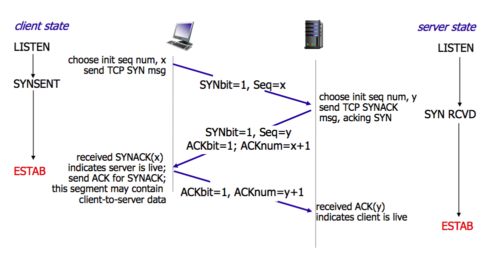
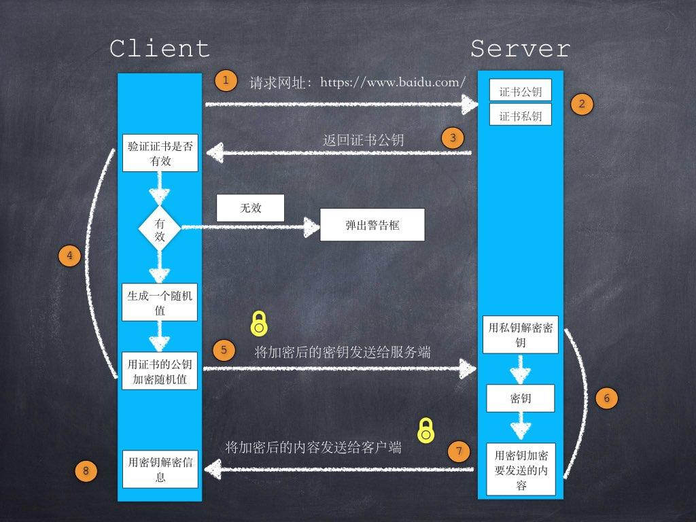

# 计算机网络

### 1  `HTTP`协议，结构

#### 1.1 什么是`http`协议

​		`HTTP`协议是`Hyper Text Transfer Protocol`（超文本传输协议）的缩写,是用于从万维网`（WWW:World Wide Web ）`服务器传输超文本到本地浏览器的传送协议。

​		`HTTP`是一个基于`TCP/IP`通信协议来传递数据（HTML 文件, 图片文件, 查询结果等）。

#### 1.2 `HTTP`协议特点

1. 简单快速：客户向服务器请求服务时，只需传送请求方法和路径。请求方法常用的有GET、HEAD、POST。每种方法规定了客户与服务器联系的类型不同。由于HTTP协议简单，使得HTTP服务器的程序规模小，因而通信速度很快。
2. 灵活：HTTP允许传输任意类型的数据对象。正在传输的类型由Content-Type加以标记。
3. 无连接：无连接的含义是限制每次连接只处理一个请求。服务器处理完客户的请求，并收到客户的应答后，即断开连接。采用这种方式可以节省传输时间。
4. 无状态：HTTP协议是无状态协议。无状态是指协议对于事务处理没有记忆能力。缺少状态意味着如果后续处理需要前面的信息，则它必须重传，这样可能导致每次连接传送的数据量增大。另一方面，在服务器不需要先前信息时它的应答就较快。如果需要用到状态存储可以使用`Session`或者`Cookie`。
5. 支持`B/S`以及`C/S`模式。

#### 1.3 `URL`和`URI`的区别

- **`URI`，是uniform resource identifier，统一资源标识符，用来唯一的标识一个资源。**

- **`URL`，是uniform resource locator，统一资源定位器，它是一种具体的URI，即URL可以用来标识一个资源，而且还指明了如何locate这个资源。**

- **`URN`，uniform resource name，统一资源命名，是通过名字来标识资源，比如mailto:java-net@java.sun.com。**

`URI`是以一种抽象的，高层次概念定义统一资源标识，而`URL`和`URN`则是具体的资源标识方式。URL和URN都是一种URI。笼统地说，每个 URL 都是 URI，但不一定每个 URI 都是 URL。这是因为 URI 还包括一个子类，即统一资源名称 (URN)，它命名资源但不指定如何定位资源。上面的 mailto、news 和 isbn URI 都是 URN 的示例。

#### 1.4 `get`和`post`区别

> **最直观的就是语义上的区别**

1. get用来获取数据，post用来提交数据

2. get参数有长度限制（受限于url长度，具体的数值取决于浏览器和服务器的限制，最长2048字节），而post无限制。

3. get请求的数据会附加在url之 ，以 " ？ "分割url和传输数据，多个参数用 "&"连接，而post请求会把请求的数据放在http请求体中。

4. get是明文传输，post是放在请求体中，但是开发者可以通过抓包工具看到，也相当于是明文的。

5. get请求会保存在浏览器历史记录中，还可能保存在web服务器的日志中

首先get和post在本质上都是tcp链接，但由于http协议和浏览器或者服务器的限制，从而使它们在应用过程中产生了差别，但是它们中还有一个较大的区别：get在请求时发送一个数据包，会将header和data一起发送过去，而post会产生两个数据包先发送header，服务器返回100，然后在发送data，服务器返回200

### 2  网络七层or四层协议

#### 2.1 为什么会有`TCP/IP`协议 

​		计算机只是单兵作战并不会发挥太大的潜力，只有将他们连接起来，才能发挥最大的作用。于是人们想方设法用电线将计算机连接了起来。但是仅仅用电线连接起来是远远不够的，他们需要通信，正如两个不同方言的人需要交流一样。所以需要定义一些共通的东西来交流，`TCP/IP`就是这么诞生的。`TCP/IP`并不是一个协议，而是一个协议簇的统称，它包括：TCP协议，IP协议，IMAC协议，http协议，ftp协议，pop3协议等。电脑有了这些，就可以实现交流了。

#### 2.2 `TCP/IP`协议分层

七层协议目前基本上只存在理论中，实际的网络协议是四层。


- **物理层：底层数据传输**
    即，电脑之间（准确来说网络设备之间）物理连接的介质，以及网络设备与网络终端之间数据传递的规则称之为物理层，其中的**数据是以比特的形式传递的。**
    **单位：比特**
- **数据链路层：定义数据的基本格式，如何传输，如何标识**
    在链路层中，需要将比特流组合成字节的组合。这种把比特流组合成字节的组合我们称之为数据帧。对**数据进行处理封装成数据帧**并传递和错误检测的层就是数据链路层。
    **单位：帧**
- **网络层：定义IP编址，定义路由功能**
    网络层就是负责选择最佳路径，并保证数据始终沿着最佳路径传输。路由器的功能就是选合适的路径。
    **单位：数据包**
- **传输层：端到端传输数据的基本功能**
    传输层就是负责将数据进行可靠或者不可靠传递，负责终端之间的传送。如：TCP、UDP
    **单位：数据段**
- **会话层：控制应用程序之间会话能力**
    会话层用来区分不同的进程。如打开两个浏览器，输入两个地址，确认输入的地址和响应的内容在自己想要的浏览器上显示，
- **表示层：数据格式标识，基本压缩加密功能**
    对传输数据进行解密压缩等，针对不同类型数据进行格式描述。如压缩加密图片后再传输，如微信界面发送信息再传输过程中加密再解密等。
- **应用层：各种应用软件，包括 Web 应用**
    应用层有点复杂，但是是我们接触的最多的，简单的说，就是我们从屏幕上看到的信息，提供人和计算机交流的层

#### 2.3 交换机和路由器的区别

1. 交换机工作在第二层，数据链路层；路由器工作在第三层，网络层。

2. 在数据链路层只能识别物理地址，因此当交换机的某个端口收到一个数据帧时，交换机会读取数据帧中相应的目标地址的MAC地址，然后在自己的MAC地址表中查找是否有目标MAC地址的端口信息，如果有，则把数据帧转发到相应的端口；如果没有，则向除源端口外的所有端口进行转发。

3. 当路由器的某个接口收到一个包时，路由器会读取包中相应目标的逻辑地址的网络部分，然后在路由表中进行查找。如果在路由表中找到了目标地址的路由条目，则把包转发到路由器的相应接口；如果在路由表中没有找到目标地址的路由条目，那么，如果路由器配置了默认路由，就根据默认路由的配置转发到路由器的相应接口；如果路由器中没有配置默认路由，则将该包丢弃，并返回不可达信息。

4. 传统的交换机只能分割冲突域，不能分割广播域；而路由器可以分割广播域；

5. 路由器提供了防火墙的服务：路由器仅仅转发特定地址的数据包，不传送不支持路由协议的数据包传送和未知目标网络数据包的传送，从而可以防止广播风暴。

### 3. 三次握手&&四次挥手

#### 3.1 TCP的特性

​		注意：TCP并不能保证数据一定会被对方接收到，因为这是不可能的。TCP能够做到的是，如果有可能，就把数据发送到接收方，否则就（通过放弃重传并且中断连接这一手段）通知用户。因此准确说TCP也不是100%可靠的协议，它所能提供的是数据的可靠传递或故障的可靠通知。

#### 3.2 三次握手

##### 3.2.1 三次握手图解

​		所谓三次握手(Three-way Handshake)，是指建立一个 TCP 连接时，需要客户端和服务器总共发送3个包。

​		三次握手的过程示意图如下：



三次握手的目的是连接服务器指定端口，建立 TCP 连接，并同步连接双方的序列号和确认号，交换 TCP 窗口大小信息。在 socket 编程中，客户端执行 `connect()`时。将触发三次握手。

- 第一次握手(SYN=1, seq=x):

    客户端发送一个 TCP 的 SYN 标志位置1的包，指明客户端打算连接的服务器的端口，以及初始序号 X,保存在包头的序列号(Sequence Number)字段里。

    发送完毕后，客户端进入 `SYN_SEND` 状态。

- 第二次握手(SYN=1, ACK=1, seq=y, ACKnum=x+1):

    服务器发回确认包(ACK)应答。即 SYN 标志位和 ACK 标志位均为1。服务器端选择自己 ISN 序列号，放到 Seq 域里，同时将确认序号(Acknowledgement Number)设置为客户的 ISN 加1，即X+1。 发送完毕后，服务器端进入 `SYN_RCVD` 状态。

- 第三次握手(ACK=1，ACKnum=y+1)

    客户端再次发送确认包(ACK)，SYN 标志位为0，ACK 标志位为1，并且把服务器发来 ACK 的序号字段+1，放在确定字段中发送给对方，并且在数据段放写ISN的+1

    发送完毕后，客户端进入 `ESTABLISHED` 状态，当服务器端接收到这个包时，也进入 `ESTABLISHED` 状态，TCP 握手结束。

##### 3.2.2 为什么要三次握手

客户端和服务端通信前要进行连接，“3次握手”的作用就是`双方都能明确自己和对方的收、发能力是正常的`。

`第一次握手`：客户端发送网络包，服务端收到了。这样服务端就能得出结论：客户端的发送能力、服务端的接收能力是正常的。

`第二次握手`：服务端发包，客户端收到了。这样客户端就能得出结论：服务端的接收、发送能力，客户端的接收、发送能力是正常的。 从客户端的视角来看，我接到了服务端发送过来的响应数据包，说明服务端接收到了我在第一次握手时发送的网络包，并且成功发送了响应数据包，这就说明，服务端的接收、发送能力正常。而另一方面，我收到了服务端的响应数据包，说明我第一次发送的网络包成功到达服务端，这样，我自己的发送和接收能力也是正常的。

`第三次握手`：客户端发包，服务端收到了。这样服务端就能得出结论：客户端的接收、发送能力，服务端的发送、接收能力是正常的。 第一、二次握手后，服务端并不知道客户端的接收能力以及自己的发送能力是否正常。而在第三次握手时，服务端收到了客户端对第二次握手作的回应。从服务端的角度，我在第二次握手时的响应数据发送出去了，客户端接收到了。所以，我的发送能力是正常的。而客户端的接收能力也是正常的。

经历了上面的三次握手过程，客户端和服务端都确认了自己的接收、发送能力是正常的。之后就可以正常通信了。

#### 3.3 四次挥手

##### 3.3.1 四次挥手图解

四次挥手过程示意图如下：


​	TCP 的连接的拆除需要发送四个包，因此称为四次挥手(Four-way handshake)，也叫做改进的三次握手。客户端或服务器均可主动发起挥手动作，在 socket 编程中，任何一方执行 `close()` 操作即可产生挥手操作。

- 第一次挥手(FIN=1，seq=x)

    假设客户端想要关闭连接，客户端发送一个 FIN 标志位置为1的包，表示自己已经没有数据可以发送了，但是仍然可以接受数据。

    发送完毕后，客户端进入 `FIN_WAIT_1` 状态。

- 第二次挥手(ACK=1，ACKnum=x+1)

    服务器端确认客户端的 FIN 包，发送一个确认包，表明自己接受到了客户端关闭连接的请求，但还没有准备好关闭连接。

    发送完毕后，服务器端进入 `CLOSE_WAIT` 状态，客户端接收到这个确认包之后，进入 `FIN_WAIT_2` 状态，等待服务器端关闭连接。

- 第三次挥手(FIN=1，seq=y)

    服务器端准备好关闭连接时，向客户端发送结束连接请求，FIN 置为1。

    发送完毕后，服务器端进入 `LAST_ACK` 状态，等待来自客户端的最后一个ACK。

- 第四次挥手(ACK=1，ACKnum=y+1)

    客户端接收到来自服务器端的关闭请求，发送一个确认包，并进入 `TIME_WAIT`状态，等待可能出现的要求重传的 ACK 包。

    服务器端接收到这个确认包之后，关闭连接，进入 `CLOSED` 状态。

    客户端等待了某个固定时间（两个最大段生命周期，2MSL，2 Maximum Segment Lifetime）之后，没有收到服务器端的 ACK ，认为服务器端已经正常关闭连接，于是自己也关闭连接，进入 `CLOSED` 状态。


##### 3.3.2 为什么要四次挥手

​    这是因为服务端在LISTEN状态下，收到建立连接请求的SYN报文后，把ACK和SYN放在一个报文里发送给客户端。而关闭连接时，当收到对方的FIN报文时，仅仅表示对方不再发送数据了但是还能接收数据，己方是否现在关闭发送数据通道，需要上层应用来决定，因此，己方ACK和FIN一般都会分开发送。

#### 3.4 SYN攻击

##### 3.4.1 什么是SYN攻击

​		在三次握手过程中，服务器发送 SYN-ACK 之后，收到客户端的 ACK 之前的 TCP 连接称为半连接(half-open connect)。此时服务器处于 SYN_RCVD 状态。当收到 ACK 后，服务器才能转入 ESTABLISHED 状态.

​		SYN 攻击指的是，攻击客户端在短时间内伪造大量不存在的IP地址，向服务器不断地发送SYN包，服务器回复确认包，并等待客户的确认。由于源地址是不存在的，服务器需要不断的重发直至超时，这些伪造的SYN包将长时间占用未连接队列，正常的SYN请求被丢弃，导致目标系统运行缓慢，严重者会引起网络堵塞甚至系统瘫痪。

​		SYN 攻击是一种典型的 DoS/DDoS 攻击。

##### 3.4.2 如何检测SYN攻击

​		检测 SYN 攻击非常的方便，当你在服务器上看到大量的半连接状态时，特别是源IP地址是随机的，基本上可以断定这是一次SYN攻击。在 Linux/Unix 上可以使用系统自带的 netstats 命令来检测 SYN 攻击。

##### 3.4.3 如何防御SYN攻击

SYN攻击不能完全被阻止，除非将TCP协议重新设计。我们所做的是尽可能的减轻SYN攻击的危害，常见的防御 SYN 攻击的方法有如下几种：

1. 无效连接的监视释放

    ​	监视系统的半开连接和不活动连接，当达到一定阈值时拆除这些连接，从而释放系统资源。这种方法对于所有的连接一视同仁，而且由于SYN Flood造成的半开连接数量很大，正常连接请求也被淹没在其中被这种方式误释放掉，因此这种方法属于入门级的SYN Flood方法。

2. 延缓TCB分配方法

    ​	消耗服务器资源主要是因为当SYN数据报文一到达，系统立即分配TCB，从而占用了资源。而SYN Flood由于很难建立起正常连接，因此，当正常连接建立起来后再分配TCB则可以有效地减轻服务器资源的消耗。常见的方法是使用Syn Cache和Syn Cookie技术。

3. Syn Cache技术

    ​	系统在收到一个SYN报文时，在一个专用HASH表中保存这种半连接信息，直到收到正确的回应ACK报文再分配TCB。这个开销远小于TCB的开销。当然还需要保存序列号。

4. Syn Cookie技术

    ​	Syn Cookie技术则完全不使用任何存储资源，这种方法比较巧妙，它使用一种特殊的算法生成Sequence Number，这种算法考虑到了对方的IP、端口、己方IP、端口的固定信息，以及对方无法知道而己方比较固定的一些信息，如MSS(Maximum Segment Size，最大报文段大小，指的是TCP报文的最大数据报长度，其中不包括TCP首部长度。)、时间等，在收到对方 的ACK报文后，重新计算一遍，看其是否与对方回应报文中的（Sequence Number-1）相同，从而决定是否分配TCB资源。

5. 使用Syn proxy防火墙

    ​	一种方式是防止墙dqywb连接的有效性后，防火墙才会向内部服务器发起SYN请求。防火墙代服务器发出的SYN ACK包使用的序列号为c, 而真正的服务器回应的序列号为c', 这样，在每个数据报文经过防火墙的时候进行序列号的修改。另一种方式是防火墙确定了连接的安全后，会发出一个safe reset命令，client会进行重新连接，这时出现的syn报文会直接放行。这样不需要修改序列号了。但是，client需要发起两次握手过程，因此建立连接的时间将会延长。

6. 增加最大半连接数

#### 3.5 TCP keeplive

​		TCP 的连接，实际上是一种纯软件层面的概念，在物理层面并没有“连接”这种概念。TCP 通信双方建立交互的连接，但是并不是一直存在数据交互，有些连接会在数据交互完毕后，主动释放连接，而有些不会。在长时间无数据交互的时间段内，交互双方都有可能出现掉电、死机、异常重启等各种意外，当这些意外发生之后，这些 TCP 连接并未来得及正常释放，在软件层面上，连接的另一方并不知道对端的情况，它会一直维护这个连接，长时间的积累会导致非常多的半打开连接，造成端系统资源的消耗和浪费，为了解决这个问题，在传输层可以利用 TCP 的 KeepAlive 机制实现来实现。主流的操作系统基本都在内核里支持了这个特性。

​		TCP KeepAlive 的基本原理是，隔一段时间给连接对端发送一个探测包，如果收到对方回应的 ACK，则认为连接还是存活的，在超过一定重试次数之后还是没有收到对方的回应，则丢弃该 TCP 连接。

### 4. `http`与`https`的区别

#### 4.1 区别

1. https协议需要到ca申请证书，一般免费证书较少，因而需要一定费用。

2. http是超文本传输协议，信息是明文传输，https则是具有安全性的ssl加密传输协议。

3. http和https使用的是完全不同的连接方式，用的端口也不一样，前者是80，后者是443。

4. http的连接很简单，是无状态的；HTTPS协议是由SSL+HTTP协议构建的可进行加密传输、身份认证的网络协议，比http协议安全。

#### 4.2 `https`全过程



1. ***客户端发起`HTTPS`请求*** 这个没什么好说的，就是用户在浏览器里输入一个`HTTPS`网址，然后连接到服务端的443端口。
2. ***服务端的配置*** 采用`HTTPS`协议的服务器必须要有一套数字证书，可以自己制作，也可以向组织申请。区别就是自己颁发的证书需要客户端验证通过，才可以继续访问，而使用受信任的公司申请的证书则不会弹出提示页面。这套证书其实就是一对公钥和私钥。如果对公钥不太理解，可以想象成一把钥匙和一个锁头，只是世界上只有你一个人有这把钥匙，你可以把锁头给别人，别人可以用这个锁把重要的东西锁起来，然后发给你，因为只有你一个人有这把钥匙，所以只有你才能看到被这把锁锁起来的东西。
3. ***传送证书*** 这个证书其实就是公钥，只是包含了很多信息，如证书的颁发机构，过期时间等等。
4. ***客户端解析证书*** 这部分工作是由客户端的SSL/TLS来完成的，首先会验证公钥是否有效，比如颁发机构，过期时间等等，如果发现异常，则会弹出一个警示框，提示证书存在的问题。如果证书没有问题，那么就生成一个***随机值***。然后用证书（也就是公钥）对这个随机值进行加密。就好像上面说的，把随机值用锁头锁起来，这样除非有钥匙，不然看不到被锁住的内容。
5. ***传送加密信息*** 这部分传送的是用证书加密后的随机值，目的是让服务端得到这个随机值，以后客户端和服务端的通信就可以通过这个随机值来进行加密解密了。
6. ***服务端解密信息*** 服务端用私钥解密后，得到了客户端传过来的随机值，然后把内容通过该随机值进行对称加密，将信息和私钥通过某种算法混合在一起，这样除非知道私钥，不然无法获取内容，而正好客户端和服务端都知道这个私钥，所以只要加密算法够彪悍，私钥够复杂，数据就够安全。
7. ***传输加密后的信息*** 这部分信息就是服务端用私钥加密后的信息，可以在客户端用随机值解密还原。
8. ***客户端解密信息*** 客户端用之前生产的私钥解密服务端传过来的信息，于是获取了解密后的内容。整个过程第三方即使监听到了数据，也束手无策。

### 5. 从输入`url`到看到页面经历的所有事情

总体来说分为以下几个过程:

#### 5.1 DNS解析

域名解析的过程是逐级查询的

1. **浏览器缓存**: 首先会向浏览器的缓存中读取上一次访问的记录，在chrome可以通过地址栏中输入chrome://net-internals/#dns查看缓存的当前状态
2. **操作系统缓存**：查找存储在系统运行内存中的缓存。在mac中可以通过下面的命令清除系统中的DNS缓存。

3. **在host文件中查找**：如果在缓存中都查找不到的情况下，就会读取系统中预设的host文件中的设置。
4. **路由器缓存**：有些路由器也有DNS缓存的功能，访问过的域名会存在路由器上。
5. **ISP DNS缓存**：互联网服务提供商（如中国电信）也会提供DNS服务，比如比较著名的 114.114.114.114，在本地查找不到的情况下，就会向ISP进行查询，ISP会在当前服务器的缓存内查找是否有记录，如果有，则返回这个IP，若没有，则会开始向根域名服务器请求查询。
6. **顶级DNS服务器/根DNS服务器**：根域名收到请求后，会判别这个域名(.com)是授权给哪台服务器管理,并返回这个顶级DNS服务器的IP。请求者收到这台顶级DNS的服务器IP后，会向该服务器发起查询，如果该服务器无法解析，该服务器就会返回下一级的DNS服务器IP（nicefilm.com），本机继续查找，直到服务器找到(www.nicefilm.com)的主机。

#### 5.2 TCP连接

三次握手

#### 5.3 发送HTTP请求

在应用层，浏览器会分析这个url，并设置好请求报文发出。请求报文中包括请求行、请求头、空行、请求主体。https默认请求端口443， http默认80。

- **请求行**：请求行中包括请求的方法，路径和协议版本。
- **请求头**：请求头中包含了请求的一些附加的信息，一般是以键值的形式成对存在，比如设置请求文件的类型accept-type，以及服务器对缓存的设置。
- **空行**：协议中规定请求头和请求主体间必须用一个空行隔开
- **请求主体**：对于post请求，所需要的参数都不会放在url中，这时候就需要一个载体了，这个载体就是请求主题。

#### 5.4 服务器处理请求并返回HTTP报文

服务端收到请求之后，会根据url匹配到的路径做相应的处理，最后返回浏览器需要的页面资源。浏览器会收到一个响应报文，而所需要的资源就就在报文主体上。与请求报文相同，响应报文也有与之对应的起始行、首部、空行、报文主体，不同的地方在于包含的东西不一样。

- **响应行**：响应报文的起始行同样包含了协议版本，与请求的起始行不同的是其包含的还有状态码和状态码的原因短语。
- **响应头**：对应请求报文中的请求头，格式一致，但是各自有不同的首部。也有一起用的通用首部。
- **空行**
- **报文主体**：请求所需要的资源。

#### 5.5 浏览器解析渲染页面

至此浏览器已经拿到了一个HTML文档，并为了呈现文档而开始解析。呈现引擎开始工作，基本流程如下（以webkit为例）

- 通过HTML解析器解析HTML文档，构建一个DOM Tree，同时通过CSS解析器解析HTML中存在的CSS，构建Style Rules，两者结合形成一个Attachment。
- 通过Attachment构造出一个呈现树（Render Tree）
- Render Tree构建完毕，进入到布局阶段（layout/reflow），将会为每个阶段分配一个应出现在屏幕上的确切坐标。
- 最后将全部的节点遍历绘制出来后，一个页面就展现出来了。

从构建DOM树到呈现的过程如下

​		需要注意的是，这是一个渐进的过程，呈现引擎为了力求显示的及时，会在文档请求不完全的情况下就开始渲染页面，同时，如果在解析的过程中遇到script的时候，文档的解析将会停止下来，立即解析执行脚本，如果脚本是外部的，则会等待请求完成并解析执行。所以，为了不阻塞页面地呈现，一般会把script脚本放在文档的最后。

​		在最新的HTML4和HTML5规范中，也可以将脚本标注为defer，这样就不会停止文档解析，而是等到解析结束后才执行。HTML5 增加了一个选项，可将脚本标记为async，以便由其他线程解析和执行。

#### 5.6 连接结束

​		现在的页面为了优化请求的耗时，默认都会开启持久连接（keep-alive），那么一个TCP连接确切关闭的时机，是这个tab标签页关闭的时候。这个关闭的过程就是著名的四次挥手。关闭是一个全双工的过程，发包的顺序的不一定的。一般来说是客户端主动发起的关闭，过程如下。

### 6. `HTTP`各版本之间差异

#### 6.1 版本

HTTP 协议从开始立项到现在一共经历了 `4` 个版本:

HTTP 0.9 -> HTTP 1.0 -> HTTP 1.1 -> HTTP 2

#### 6.2 `HTTP0.9`版本

HTTP 0.9 是一个最古老的版本

- 只支持`GET`请求方式：由于不支持其他请求方式，因此客户端是没办法向服务端传输太多的信息
- 没有请求头概念：所以不能在请求中指定版本号，服务端也只具有返回 HTML字符串的能力
- 服务端相响应之后，立即关闭TCP连接

#### 6.3 `HTTP1.0`版本

随着 HTTP 1.0 的发布，这个版本:

- 请求方式新增了POST，DELETE，PUT，HEADER等方式

- 增添了请求头和响应头的概念，在通信中指定了 HTTP 协议版本号，以及其他的一些元信息 (比如: 状态码、权限、缓存、内容编码)

- 扩充了传输内容格式，图片、音视频资源、二进制等都可以进行传输

- **Content-Type**定义各种格式，

    在 HTTP 1.0 的时候，任何的资源都可以被传输，传输的格式呢也是多种多样的，客户端在收到响应体的内容的时候就是根据这个 `Content-Type` 去进行解析的。所以服务端返回时候必须带着这个字段。

- **无状态**：服务器不跟踪不记录请求过的状态

- **无连接**：浏览器每次请求都需要建立tcp连接

    无连接导致的性能缺陷有两种：

    - 无法复用连接
        每次发送请求，都需要进行一次tcp连接（即3次握手4次挥手），使得网络的利用率非常低
    - 队头阻塞
        HTTP 1.0 规定在前一个请求响应到达之后下一个请求才能发送，如果前一个阻塞，后面的请求也给阻塞的

#### 6.4 `HTTP1.1`版本

- 长连接：新增Connection字段，可以设置keep-alive值保持连接不断开。HTTP 1.1默认保持长连接，数据传输完成保持tcp连接不断开,继续用这个通道传输数据
- 管道化：基于上面长连接的基础，管道化可以不等第一个请求响应继续发送后面的请求，但响应的顺序还是按照请求的顺序返回
- 缓存处理：新增字段cache-control
- 断点传输：range字段与content-range字段

#### 6.5 `HTTP2.0`版本

特性:

- 二进制分帧
- 多路复用： 在共享TCP链接的基础上同时发送请求和响应。在共享TCP链接的基础上同时发送请求和响应，基于二进制分帧，在同一域名下所有访问都是从同一个tcp连接中走，http消息被分解为独立的帧，乱序发送，服务端根据标识符和首部将消息重新组装起来。
- 头部压缩，由于 HTTP 是无状态的，每一个请求都需要头部信息标识这次请求相关信息，所以会造成传输很多重复的信息，当请求数量增大的时候，消耗的资源就会慢慢积累上去。所以 HTTP 2 可以维护一个头部信息字典，差量进行更新头信息，减少头部信息传输占用的资源，详见 [HTTP/2 头部压缩技术介绍](https://imququ.com/post/header-compression-in-http2.html)。
- 服务器推送：服务器可以额外的向客户端推送资源，而无需客户端明确的请求

### 7. 浏览器有哪些缓存方式

强缓存：Expires，Cache-Control

协商缓存：Last-Modified / If-Modified-Since和Etag / If-None-Match

强制缓存优先于协商缓存进行，若强制缓存(Expires和Cache-Control)生效则直接使用缓存，若不生效则进行协商缓存(Last-Modified / If-Modified-Since和Etag / If-None-Match)，协商缓存由服务器决定是否使用缓存，若协商缓存失效，那么代表该请求的缓存失效，重新获取请求结果，再存入浏览器缓存中；生效则返回304，继续使用缓存，主要过程如下：

#### 7.1 Expires

Expires是HTTP/1.0控制网页缓存的字段，其值为服务器返回该请求结果缓存的到期时间，即再次发起该请求时，如果客户端的时间小于Expires的值时，直接使用缓存结果。

到了HTTP/1.1，Expire已经被Cache-Control替代，原因在于Expires控制缓存的原理是使用客户端的时间与服务端返回的时间做对比，那么如果客户端与服务端的时间因为某些原因（例如时区不同；客户端和服务端有一方的时间不准确）发生误差，那么强制缓存则会直接失效，这样的话强制缓存的存在则毫无意义，那么Cache-Control又是如何控制的呢？

#### 7.2 Cache-Control

在HTTP/1.1中，Cache-Control是最重要的规则，主要用于控制网页缓存，主要取值为：

- public：所有内容都将被缓存（客户端和代理服务器都可缓存）
- private：所有内容只有客户端可以缓存，Cache-Control的默认取值
- no-cache：客户端缓存内容，但是是否使用缓存则需要经过协商缓存来验证决定
- no-store：所有内容都不会被缓存，即不使用强制缓存，也不使用协商缓存
- max-age=xxx (xxx is numeric)：缓存内容将在xxx秒后失效

#### 7.3 Last-Modified / If-Modified-Since

Last-Modified是服务器响应请求时，返回该资源文件在服务器最后被修改的时间

If-Modified-Since则是客户端再次发起该请求时，携带上次请求返回的Last-Modified值，通过此字段值告诉服务器该资源上次请求返回的最后被修改时间。服务器收到该请求，发现请求头含有If-Modified-Since字段，则会根据If-Modified-Since的字段值与该资源在服务器的最后被修改时间做对比，若服务器的资源最后被修改时间大于If-Modified-Since的字段值，则重新返回资源，状态码为200；否则则返回304，代表资源无更新，可继续使用缓存文件

#### 7.4 Etag / If-None-Match

​		`Etag`是服务器响应请求时，返回当前资源文件的一个唯一标识(由服务器生成)

​		If-None-Match是客户端再次发起该请求时，携带上次请求返回的唯一标识Etag值，通过此字段值告诉服务器该资源上次请求返回的唯一标识值。服务器收到该请求后，发现该请求头中含有If-None-Match，则会根据If-None-Match的字段值与该资源在服务器的Etag值做对比，一致则返回304，代表资源无更新，继续使用缓存文件；不一致则重新返回资源文件，状态码为200

​		注：Etag / If-None-Match优先级高于Last-Modified / If-Modified-Since，同时存在则只有Etag / If-None-Match生效。

### 8. 跨域形成原因以及解决方案

#### 8.1 什么是跨域？

​		同源策略是一种约定，它是浏览器最核心也最基本的安全功能，如果缺少了同源策略，浏览器很容易受到XSS、CSRF等攻击。所谓同源是指"协议+域名+端口"三者相同，即便两个不同的域名指向同一个ip地址，也非同源。

**同源策略限制内容有：**

- Cookie、LocalStorage、IndexedDB 等存储性内容
- DOM 节点
- AJAX 请求发送后，结果被浏览器拦截了

但是有三个标签是允许跨域加载资源：

- ``
- `<link href=XXX>`
- `<script src=XXX>`

**跨域并不是请求发不出去，请求能发出去，服务端能收到请求并正常返回结果，只是结果被浏览器拦截了**。你可能会疑问明明通过表单的方式可以发起跨域请求，为什么 Ajax 就不会?因为归根结底，跨域是为了阻止用户读取到另一个域名下的内容，Ajax 可以获取响应，浏览器认为这不安全，所以拦截了响应。但是表单并不会获取新的内容，所以可以发起跨域请求。同时也说明了跨域并不能完全阻止 CSRF，因为请求毕竟是发出去了。

#### 8.2 跨域解决方案

##### 8.2.1 JSONP

**利用 `<script>` 标签没有跨域限制的漏洞，网页可以得到从其他来源动态产生的 JSON 数据。JSONP请求一定需要对方的服务器做支持才可以。**

JSONP优点是简单兼容性好，可用于解决主流浏览器的跨域数据访问的问题。**缺点是仅支持get方法具有局限性,不安全可能会遭受XSS攻击。**

例如当向`http://localhost:3000/say?wd=Iloveyou&callback=show`这个地址请求数据，后台返回`show('我不爱你')`，最后会运行show()这个函数，打印出'我不爱你'

```javascript
// server.js
let express = require('express')
let app = express()
app.get('/say', function(req, res) {
  let { wd, callback } = req.query
  console.log(wd) // Iloveyou
  console.log(callback) // show
  res.end(`${callback}('我不爱你')`)
})
app.listen(3000)
```

##### 8.2.2 CORS

**CORS 需要浏览器和后端同时支持。IE 8 和 9 需要通过 XDomainRequest 来实现**。

浏览器会自动进行 CORS 通信，实现 CORS 通信的关键是后端。只要后端实现了 CORS，就实现了跨域。

服务端设置 Access-Control-Allow-Origin 就可以开启 CORS。 该属性表示哪些域名可以访问资源，如果设置通配符则表示所有网站都可以访问资源。

虽然设置 CORS 和前端没什么关系，但是通过这种方式解决跨域问题的话，会在发送请求时出现两种情况，分别为**简单请求**和**复杂请求**。

```javascript
app.use(function(req, res, next) {
  let origin = req.headers.origin
  if (whitList.includes(origin)) {
    // 设置哪个源可以访问我
    res.setHeader('Access-Control-Allow-Origin', origin)
    // 允许携带哪个头访问我
    res.setHeader('Access-Control-Allow-Headers', 'name')
    // 允许哪个方法访问我
    res.setHeader('Access-Control-Allow-Methods', 'PUT')
    // 允许携带cookie
    res.setHeader('Access-Control-Allow-Credentials', true)
    // 预检的存活时间
    res.setHeader('Access-Control-Max-Age', 6)
    // 允许返回的头
    res.setHeader('Access-Control-Expose-Headers', 'name')
    if (req.method === 'OPTIONS') {
      res.end() // OPTIONS请求不做任何处理
    }
  }
  next()
})
```

CORS有两种请求：简单请求和复杂请求

只要同时满足以下两大条件，就属于简单请求。
（1) 请求方法是以下三种方法之一：

- HEAD
- GET
- POST

（2）HTTP的头信息不超出以下几种字段：

- Accept
- Accept-Language
- Content-Language
- Last-Event-ID
- Content-Type：只限于三个值application/x-www-form-urlencoded、multipart/form-data、text/plain

非简单请求会发出一次预检测请求，返回码是204，预检测通过才会真正发出请求，这才返回200。这里通过前端发请求的时候增加一个额外的headers来触发非简单请求。

##### 8.2.3 Node中间件代理

实现原理：**同源策略是浏览器需要遵循的标准，而如果是服务器向服务器请求就无需遵循同源策略。** 代理服务器，需要做以下几个步骤：

- 接受客户端请求 。
- 将请求 转发给服务器。
- 拿到服务器 响应 数据。
- 将 响应 转发给客户端。

##### 8.2.4 nginx反向代理

实现原理类似于Node中间件代理，需要你搭建一个中转nginx服务器，用于转发请求。

使用nginx反向代理实现跨域，是最简单的跨域方式。只需要修改nginx的配置即可解决跨域问题，支持所有浏览器，支持session，不需要修改任何代码，并且不会影响服务器性能。

实现思路：通过nginx配置一个代理服务器（域名与domain1相同，端口不同）做跳板机，反向代理访问domain2接口，并且可以顺便修改cookie中domain信息，方便当前域cookie写入，实现跨域登录。

##### 8.2.5 window.postMessage

postMessage是HTML5 XMLHttpRequest Level 2中的API，且是为数不多可以跨域操作的window属性之一，它可用于解决以下方面的问题：

- 页面和其打开的新窗口的数据传递
- 多窗口之间消息传递
- 页面与嵌套的iframe消息传递
- 上面三个场景的跨域数据传递

**postMessage()方法允许来自不同源的脚本采用异步方式进行有限的通信，可以实现跨文本档、多窗口、跨域消息传递**

##### 8.2.6 websocket

Websocket是HTML5的一个持久化的协议，它实现了浏览器与服务器的全双工通信，同时也是跨域的一种解决方案。WebSocket和HTTP都是应用层协议，都基于 TCP 协议。但是 **WebSocket 是一种双向通信协议，在建立连接之后，WebSocket 的 server 与 client 都能主动向对方发送或接收数据**。同时，WebSocket 在建立连接时需要借助 HTTP 协议，连接建立好了之后 client 与 server 之间的双向通信就与 HTTP 无关了。

### Chrome设置小于12px的字体

### 如何给localStorage加上max-age功能

### 事件委托应用场景，e.target和e.currentTarget

### 事件机制
